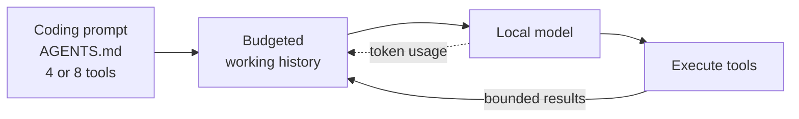
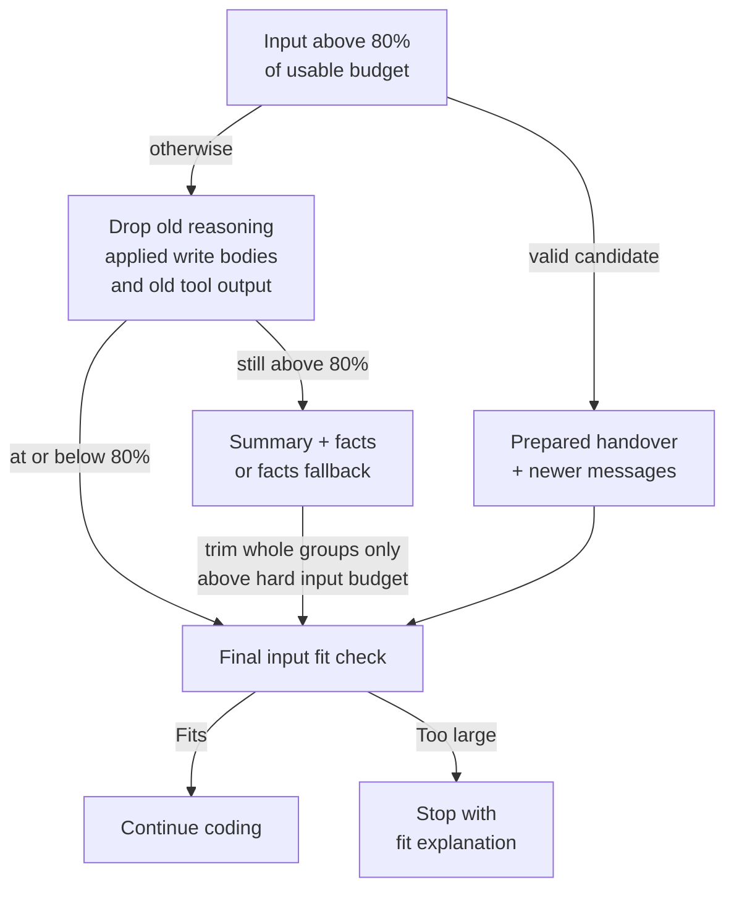
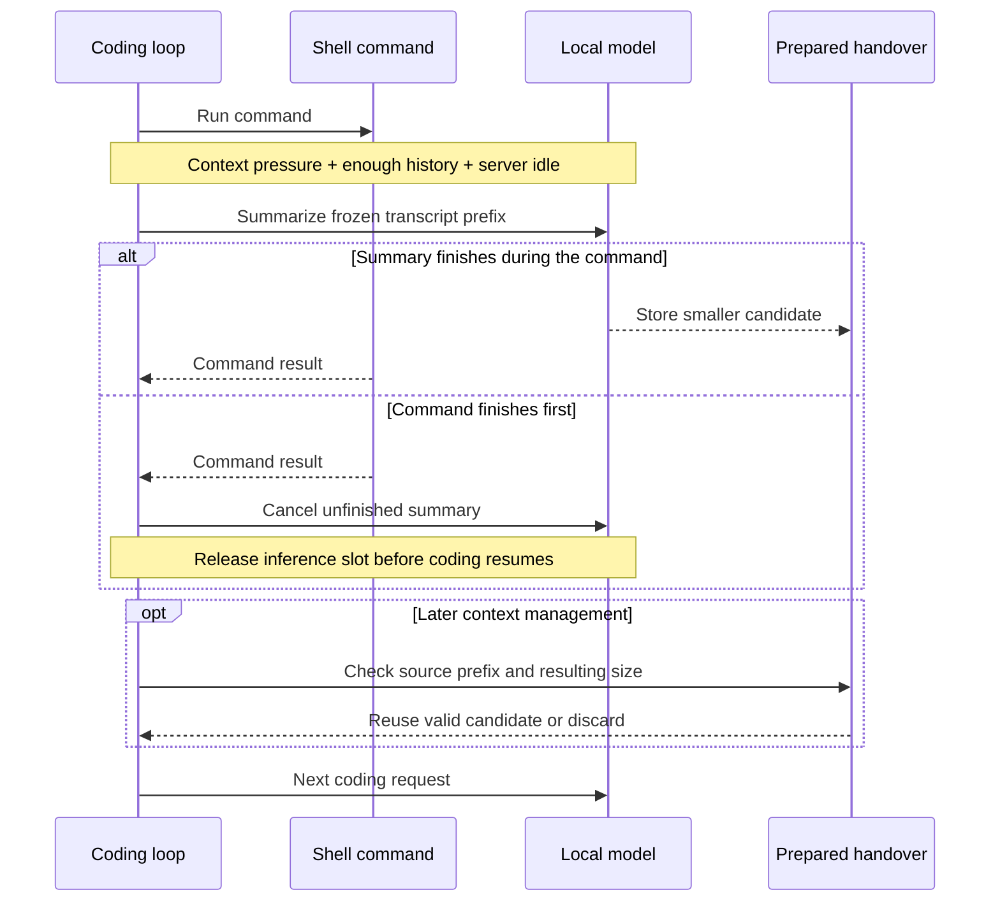
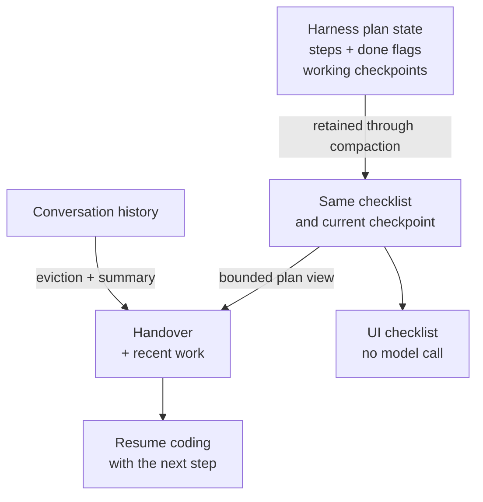

# smolcoder

A smol coding agent for the models already running on your machine.

If you have Ollama or LM Studio running, you are two commands away from an AI pair programmer that reads your code, edits files, runs your tests and starts your dev server, all without an API key or a config file.

```bash
npm install -g smolcoder
smol
```

That is the whole setup. smolcoder finds your local server, lists the models you already have, and drops you into a session.

## Why you might like it

smolcoder is built around a specific constraint: a free, local, open-weight model with a small loaded context window and limited inference capacity. It keeps the coding instructions and tool interface small, stores progress in the harness, and makes room for the next edit before the window fills. The aim is to spend more of that window on useful code and the current task.

- **Zero config.** It probes Ollama on IPv4 and IPv6 loopback, respects `OLLAMA_HOST`, and checks running Docker containers that publish Ollama's port. It also probes the standard LM Studio port.
- **Built for small context windows.** A short coding prompt, eight flat tools (four in read-only mode), and context-sized limits on tool output.
- **Context handled for you.** It reads the real token counts from the backend, shows a live context meter, and evicts old tool output to reduce the need for conversation summaries.
- **Background handovers.** When context is filling up, time spent waiting on a command can be used to prepare a summary with the same model. Coding takes priority; unfinished summaries are cancelled and stale summaries are discarded.
- **Visible recovery.** Interrupted streams, stalled servers, repeated failed tools and empty replies have bounded recovery. A failed or cancelled headless turn exits unsuccessfully; progress stays in the interactive session for continuation.
- **Small-model-friendly tools.** Every tool has an example call in its description, error messages coach the model toward the fix, and the edit tool tolerates whitespace drift.
- **A checklist that survives compaction.** The harness retains the plan, the current step's working checkpoint and the next unfinished step.
- **Runs anywhere Node runs.** Windows, macOS and Linux. Zero runtime dependencies.

## Built around the next coding step

Each coding request contains a short system prompt, project instructions from `AGENTS.md` when present, the tools allowed by the current mode, and a budgeted working history. Tool selection is deliberately simple: eight tools in edit/bypass mode, four in read-only mode. Tool schemas use flat parameters and example calls; file reads and command results have bounded output.



The harness handles bookkeeping, output limits and recovery in code. The model concentrates on choosing the next action and writing the change. This is the design advantage for constrained models; it is not a measured speed or quality advantage over every other harness. See [context management](#context-management), [planning](#planning-that-survives-compaction), and [the comparison](#how-this-compares).

## Setup

You need two things.

1. **Node.js 18 or newer.** Get it from [nodejs.org](https://nodejs.org) if you do not have it.
2. **A local model server**, either:
   - [Ollama](https://ollama.com) with a tool-capable model pulled, for example `ollama pull qwen3`, or
   - [LM Studio](https://lmstudio.ai) with a model loaded and its local server running (Developer tab, then Start Server).

Then install and start:

```bash
npm install -g smolcoder
cd your-project
smol
```

Prefer not to install anything globally? `npx smolcoder` works too.

## Your first session

smolcoder opens straight into a chat with the last model you used, or the first one it detects. Type what you want done and press enter. The agent reads files, makes edits, and runs commands inside your project folder, telling you what it is doing as it goes.

A few keys worth knowing from the start:

| Key | What it does |
|---|---|
| `/` | Opens the slash-command menu with autocomplete |
| `shift+tab` | Cycles the permission mode: read-only, edit, bypass |
| `esc` | Cancels the running turn, or clears the input |
| `ctrl+c` twice | Quits |

The status line under the input shows the current mode, model, reasoning effort, how full the context window is, and any background tasks you have running.

`/context` shows the input estimate, loaded-window budget, reserved reply tokens and remaining space. Measurements anchor the estimate after each response; text added afterwards is estimated. `/compact` explicitly compacts even below the automatic threshold.

## Slash commands

| Command | What it does |
|---|---|
| `/models` | Switch model. Type to filter the list. |
| `/mode` | Set the permission mode (`ro`, `edit`, `bypass`) |
| `/effort` | Set reasoning effort (`off`, `low`, `medium`, `high`, `default`) |
| `/plan` | Show the agent's current checklist |
| `/context` | Show context window usage |
| `/compact` | Compact the conversation now |
| `/tasks`, `/logs <id>`, `/stop <id>` | Inspect and stop background tasks such as dev servers |
| `/clear` | Start a fresh conversation |
| `/help`, `/exit` | Help and quit |

## Modes

The mode decides which tools the model even knows about. In read-only mode it is never told a write tool exists.

| Mode | Files | Commands |
|---|---|---|
| `ro` | read and search only | none |
| `edit` (default) | read, write, edit | runs freely inside the project folder. Anything reaching outside it asks you first. |
| `bypass` | read, write, edit | never asks |

File tools are sandboxed to the project folder, symlinks included. In edit mode each command is scanned before it runs, and paths outside the folder, home-directory or temp-directory references, and global package installs all trigger an approval prompt that shows the reason. This is a text scan rather than an OS sandbox, so a script the model runs could still reach outside. Use read-only mode for code you do not trust, and bypass when you want no prompts at all.

## Handy options

```bash
smol                            # current folder, remembers your last model and mode
smol path/to/project            # a specific project
smol --model qwen3              # pick a model by partial name
smol --effort off               # no thinking: the fastest setting for long tool loops
smol --mode bypass              # never ask for approval
smol --ctx 16384                # cap the context window
smol --web                      # browser UI with a workspace sidebar (see below)
smol -p "fix the failing test"  # headless: run one prompt, print the transcript, exit
```

Headless mode is for scripts and automation. It suppresses reasoning noise and the exit code tells you whether the run succeeded.

## The web UI

`smol --web` serves a local browser UI and prints a private URL (it carries a random key, and the server only listens on localhost). You can run it from anywhere, including your home folder: the page has a sidebar of your workspaces, and every workspace keeps its own list of sessions.

- **Many projects, many sessions.** Open a folder from the sidebar, start as many sessions as you like, and switch between them while they work. A dot next to each session shows whether it is busy, idle, or waiting for you to approve a command. Sessions you are not looking at keep streaming in the background.
- **Sessions survive restarts.** Transcripts are saved under `~/.smolcoder/sessions/`, so past sessions stay in the sidebar and can be resumed with a click, model and all. Close a session to stop it, delete it to forget it.
- **Named for you.** After the first exchange the model writes a short title for the session, one quick call with thinking off. Double-click a session in the sidebar to rename it; your name sticks.
- **One server for everything.** Running `smol --web` from a second folder adds that folder to the already-running UI instead of starting another server.
- **A browser panel.** The globe icon opens a resizable panel on the right with browser tabs. Dev servers the agent starts show up as suggestions, so previewing the app it is building is one click.
- **A terminal panel.** The terminal icon (or ctrl+`) opens a shell in the current workspace, right next to the chat. It streams output without a TTY, which means interactive programs such as `vim` will not work there, but `npm test`, `git status` and friends do. The terminal, browser tabs and chat all live in the same panel, in tabs.
- `ctrl+b` hides and shows the sidebar.

Model, permission mode, reasoning and context controls are grouped beneath the composer. Tool activity is collapsed by default; expand a row to inspect its output. Errors open automatically. The `?` button contains keyboard shortcuts.

## Context management

The budget follows the context allocated by the local server when that information is available. A model advertised as supporting a large window may be loaded with a much smaller one. A smaller allocation detected at the start of a turn or after its first response reduces smolcoder's budget automatically.

Before sending a coding request, smolcoder reserves space for its reply and a safety margin:

```text
reply reserve = clamp(floor(window / 4), 128, 8192) tokens
safety margin = min(256, floor(window * 0.05)) tokens
usable input  = window - reply reserve - safety margin
```

| Loaded window | Reply reserve | Safety margin | Usable input |
|---|---:|---:|---:|
| 4,096 tokens | 1,024 | 204 | 2,868 |
| 16,384 tokens | 4,096 | 256 | 12,032 |

The input budget includes instructions, tool schemas, requests and history. Backend token counts anchor the estimate after each response; newly added text is estimated conservatively, with calibration from observed usage. The meter is an estimate between responses, not an exact tokenizer. Reasoning history is counted according to what each provider actually replays.

### Compaction in stages

Large obsolete file reads are replaced with stubs after a successful edit or write. Before a subsequent model request, context management normally starts above **80% of the usable input budget**. A completed, valid background handover can be reused immediately; otherwise older reasoning, completed write payloads and old tool output are removed before asking the model to summarize. The newest tool group is protected. If the remaining content cannot shrink further, repeated futile summaries are suppressed while the final fit check stays active.



Eviction aims for 60% to create headroom. The handover combines **harness-recorded facts** with a short **model-written narrative**:

- The original and current requests are retained. The system prompt and loaded `AGENTS.md` remain in place.
- The plan comes first in a bounded facts section, followed by touched files and recent command outcomes. These facts are assembled from state rather than reconstructed by the summarizer.
- The model receives a sized digest and previous handover, with three headings: **In progress**, **Next** and **Notes**. It is asked to preserve exact APIs and unresolved errors without repeating the goal and checklist. Reasoning is off, tools are absent, output is capped at 700 tokens and the deadline is 45 seconds. The returned narrative also has a context-sized character cap.
- Very small budgets skip model summarization. A failed foreground summary falls back to recorded facts and the previous narrative. Recent assistant/tool groups stay paired; whole groups are removed only when necessary to fit the hard input budget. Crossing the 80% soft target alone does not erase the source just read.

File reads return contiguous, context-sized pages with an accurate continuation line. Recent command records retain exit outcomes rather than entire inline scripts. Repeated unchanged reads trigger coaching and eventually a recoverable stop, so a model cannot spend an entire session rereading the same modules indefinitely. Model-written summaries and checkpoints remain advisory; current files and tool results take precedence.

Failed edits return a bounded source range and continuation arguments. Bash pipelines preserve upstream failure codes, and long command logs retain both their beginning and final error details. These checks keep verification failures visible to the model.

`/compact` forces compaction even below the automatic threshold. A window that cannot hold the remaining instructions and requests produces an actionable error. Summaries are lossy, and the facts section is bounded: keep steps concise, retain project conventions in `AGENTS.md`, and re-read source files when exact code matters.

### Background compaction on the same local model

At **60% of usable input**, a sufficiently long history can be snapshotted while `run_command` is running. The same local model prepares a handover during that wait. This overlaps shell work with inference; coding and maintenance inference share a single slot per server URL within the smolcoder process.



The snapshot excludes the unresolved tool batch. Reuse requires an unchanged source prefix, a smaller result and a combined prompt within the 80% target; messages appended since the snapshot are kept. A new turn, changed configuration or transcript changes can invalidate the candidate. Optional summaries and session titles yield to foreground inference, and are deferred when the server is busy. Separate processes and external clients have separate scheduling, so this is not a machine-wide GPU lock.

This can hide summary latency behind a long command without requiring a second model. Short commands may leave no time to finish, and summarization still consumes compute and can disturb the backend's prompt cache. The synchronous path remains available.

## Planning that survives compaction

Multi-step work uses a checklist owned by the harness. It contains up to 20 steps, each with text, a completion flag and an optional working checkpoint. The harness derives the current step as the first unfinished one. Compaction can replace the conversation while this state remains intact. The prompt asks for runnable increments: wire an entry point and verify it before expanding the application.



The model creates a plan with one newline-separated string:

```json
{"action":"set","steps":"Inspect the failing test\nImplement the fix\nRun the tests"}
```

To advance, it calls the same `plan` tool with `{"action":"done"}`. The harness marks the current step and returns `Done: 1. Next: 2. Implement the fix`. The model can also finish a numbered step, append a step, or inspect the checklist with `show`.

During an investigation, `{"action":"checkpoint","text":"save.js exports makeSaver(storage, size); next: replace missing imports"}` replaces the current step's notes, up to 1,000 characters. The checkpoint is kept verbatim in plan state and re-injected with the active step, so an exact interface need not be repeatedly reconstructed by the summarizer. Completed-step notes remain in stored state but leave the active prompt. After a long sequence of reads, the agent receives a reminder to record its findings and make a small, verifiable edit.

That small contract is the optimization: no nested step objects, no status vocabulary to regenerate, and no need to rewrite the full plan on every completion. UI rendering adds no inference call; tool arguments, feedback and the model-facing checklist still use tokens. After four non-plan tool calls with unfinished work, a short reminder is attached to the tool result. A premature final answer can receive a bounded continuation nudge.

The complete checklist survives compaction in both interfaces. Web session snapshots also save it for restart/resume; terminal sessions keep it for the running session. Its representation in a handover shares a capped facts budget, so very long step text can be shortened there while the underlying checklist remains available through `plan` / `/plan`.

This is a sequential execution checklist. It does not schedule a dependency graph, delegate work, require a separate planning model, or verify that a checked step is correct. Make verification an explicit step and run the tests.

## How this compares

Planning and compaction are established techniques. smolcoder's distinction is the combination of a small default interface, state-backed progress, measured local context budgets and opportunistic maintenance on the same model. The comparison below describes documented mechanisms, checked on **13 September 2026**; it is not a benchmark ranking.

| Harness | Planning | Context and local-model support |
|---|---|---|
| **smolcoder** | One flat `plan` tool, incremental completion, harness-derived next step and checklist state retained through compaction. | Eight coding tools, or four in read-only mode; loaded-window budgets; staged eviction; same-model background handovers with foreground priority. |
| **Claude Code** | Plan mode for exploring and proposing changes; task tools can track status and dependencies, with availability depending on model/settings. [Architecture](https://code.claude.com/docs/en/how-claude-code-works), [task tools](https://code.claude.com/docs/en/tools-reference#task-tool-availability). | Its documented Claude workflow also clears old tool output before summarizing, and defers MCP tool definitions. These techniques are shared, rather than unique to smolcoder. [Context management](https://code.claude.com/docs/en/how-claude-code-works#the-context-window). |
| **Codex** | A planning mode plus structured plan updates with step statuses. [Commands](https://learn.chatgpt.com/docs/developer-commands?surface=cli), [plan events](https://learn.chatgpt.com/docs/app-server#turn-events). | Automatic compaction has a configurable token threshold. Codex also supports Ollama and LM Studio through `--oss`; local execution alone is not a smolcoder differentiator. [Configuration](https://learn.chatgpt.com/docs/config-file/config-reference). |
| **OpenCode** | Separate Build and Plan agents, plus a `todowrite` tool for tracking multi-step work. [Agents](https://opencode.ai/docs/agents/#built-in), [todos](https://opencode.ai/docs/tools/#todowrite). | Supports local providers, automatic compaction, optional old-output pruning and a configurable compaction reserve. [Providers](https://opencode.ai/docs/providers/#ollama), [compaction settings](https://opencode.ai/docs/config/#compaction). |

For a small local model, smolcoder offers these choices together without configuring a broader agent system. The expected benefit is less prompt and bookkeeping overhead, more deliberate use of a small window, and fewer competing inference requests. The tradeoff is a narrower feature set and a simple sequential plan. Relative speed, code quality and completion rate still need matched tests using the same model, hardware, task and context allocation.

The current validation includes a live Ollama run at a **4,096-token window**: 24 tool calls, eight compactions, all five plan steps completed, and eight generated tests passed and independently rerun. That demonstrates continuity under pressure on a small task; it does not establish superiority over the harnesses above. The [audit record](docs/audit-2026-09-13.md#validation-and-limits) includes the setup and limits, and [the smoke-test prompt](bench/context-smoke.txt) is repeatable in a disposable project.

A larger trial built a playable Minecraft-inspired voxel sandbox through Ollama, followed by supervised repairs and independent browser checks. Its initial 8k and 16k builds stalled; focused repairs produced the working result. The [full lifecycle record](docs/lifecycle-2026-09-13.md) documents those failures, the resulting harness changes, acceptance tests and fault-injection checks. This is evidence of a recoverable workflow, not unattended complex-build reliability.

Implementation: [context manager](src/context.ts), [plan state](src/plan.ts), [agent loop](src/agent.ts), [tool schemas](src/tools/index.ts), [inference scheduler](src/providers/scheduler.ts).

## Local APIs and failure recovery

Ollama uses [native chat](https://docs.ollama.com/api/chat) for tools, thinking, keep-alive and token/timing usage, plus [running-model information](https://docs.ollama.com/api/ps) for loaded context. LM Studio uses its [native model catalog](https://lmstudio.ai/docs/developer/rest/list) and [OpenAI-compatible tool streaming](https://lmstudio.ai/docs/developer/openai-compat/chat-completions). For an unloaded LM Studio model, an explicit `--ctx` uses the [native load API](https://lmstudio.ai/docs/developer/rest/load) and checks the returned allocation. Already-loaded models are not reloaded to enlarge their windows.

Requests have a three-minute silence timeout and a fifteen-minute total deadline. Transient failures retry up to three attempts, with cancellable backoff. Context-overflow recovery gets one forced compaction attempt. Malformed or incomplete streams cannot execute partial tool calls. Repeated empty responses and repeated tools without progress stop with a recoverable error, and failed or cancelled headless runs exit unsuccessfully.

If reasoning consumes the entire reply without producing an answer or tool call, the harness announces one continuation with thinking disabled. The session's chosen effort is restored on the following request. This avoids asking the model to repeat the same over-budget reasoning indefinitely; recovery remains bounded.

Restored web sessions repair interrupted tool conversations and retire old approval buttons; an interrupted command's outcome must be inspected before retrying. These protections make failures visible and preserve a path to continuation. They cannot guarantee that a local server stays running or that generated code is correct.

## Tips

**Match reasoning to the available budget.** `/effort off` leaves more generation capacity for tool calls and code. Reasoning can help with difficult decisions, but some models spend the entire reply budget on it. Start with small runnable increments and use a larger loaded window when the task needs several module interfaces at once. Models without a thinking switch fall back gracefully.

**Give the agent a memory.** If your project has an `AGENTS.md` file, its contents are injected after the system prompt and survive compaction. Put your conventions, commands and quirks there.

**Let it run things in the background.** The agent can start dev servers and watchers as background tasks, check their logs, and stop them. They show up in the status line and are killed when smolcoder exits.

**Curious about the numbers?** Benchmarks, Ollama versus LM Studio tuning notes, and what happens when the context window is squeezed are all in [docs/backend-notes.md](docs/backend-notes.md).

## Contributing

Issues and pull requests are welcome at [github.com/leonvanzyl/smolcoder](https://github.com/leonvanzyl/smolcoder). Clone it, run `npm install`, then `npm test`.

## License

[MIT](LICENSE)
